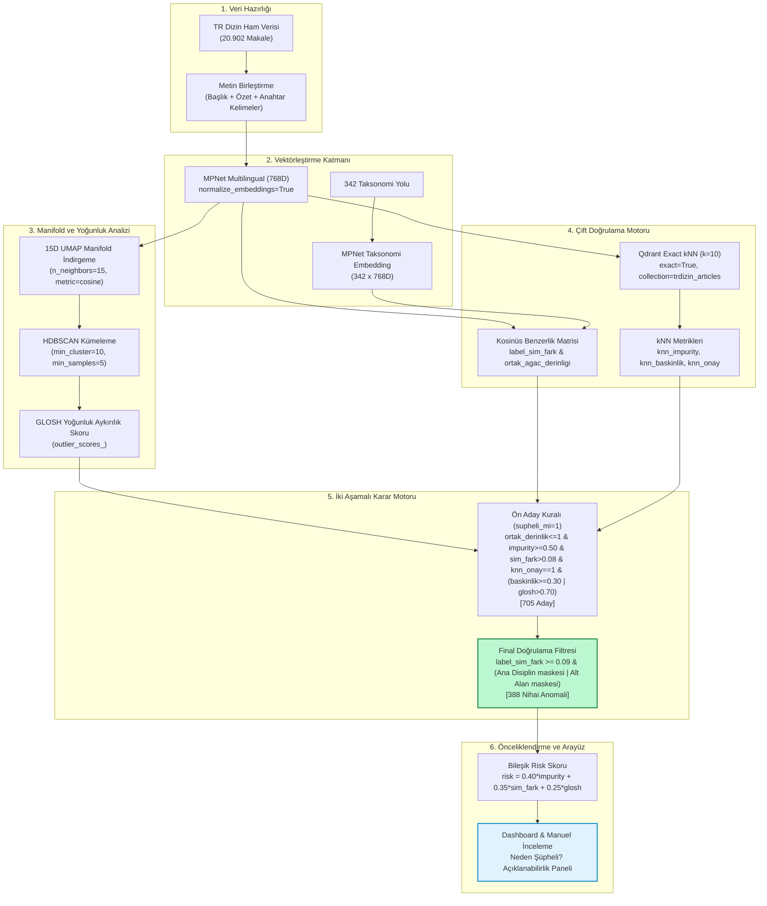

# TR DİZİN DİSİPLİN UYUŞMAZLIĞI VE ANOMALİ TESPİT SİSTEMİ
## Kapsamlı Metodoloji, Deneysel Doğrulama ve Teknik Devir (Handoff) Dokümanı

> **Doküman Versiyonu:** 1.0 (Nihai Üretim ve Metodoloji Raporu)  
> **Tarih:** Eylül 2026  

---

## İçindekiler
1. [Projenin Amacı ve Problem Tanımı](#1-projenin-amacı-ve-problem-tanımı)
2. [Veri Kaynağı ve Veri Yapısı](#2-veri-kaynağı-ve-veri-yapısı)
3. [Metin Temsili ve Embedding Modeli](#3-metin-temsili-ve-embedding-modeli)
4. [Boyut İndirgeme ve Yoğunluk Tabanlı Analiz](#4-boyut-indirgeme-ve-yoğunluk-tabanlı-analiz)
5. [Taksonomi Semantik Tutarlılık Analizi](#5-taksonomi-semantik-tutarlılık-analizi)
6. [Yerel Doğrulama: Qdrant Exact kNN](#6-yerel-doğrulama-qdrant-exact-knn)
7. [Ön Aday Karar Mekanizması](#7-ön-aday-karar-mekanizması)
8. [Final Doğrulama Filtresi](#8-final-doğrulama-filtresi)
9. [Bileşik Risk / Manuel İnceleme Önceliği](#9-bileşik-risk--manuel-inceleme-önceliği)
10. [Pipeline Funnel / Mevcut Üretim Sonucu](#10-pipeline-funnel--mevcut-üretim-sonucu)
11. [Manuel Doğrulama](#11-manuel-doğrulama)
12. [Ablation Çalışması](#12-ablation-çalışması)
13. [FP Hata Mekanizmaları](#13-fp-hata-mekanizmaları)
14. [Role-Aware Deneyleri (Production Dışı Metodoloji Araştırması)](#14-role-aware-deneyleri-production-dışı-metodoloji-araştırması)
    - [14.1 Role-Aware Hypothesis Pretest](#141-role-aware-hypothesis-pretest)
    - [14.2 Controlled Oracle Experiment](#142-controlled-oracle-experiment)
    - [14.3 Automatic Role Extraction (Zero-Shot Multilingual NLI)](#143-automatic-role-extraction-zero-shot-multilingual-nli)
15. [Nihai Production Metodolojisi](#15-nihai-production-metodolojisi)
16. [Parametrelerin Kanıt Durumu](#16-parametrelerin-kanıt-durumu)
17. [Dashboard ve Explainability](#17-dashboard-ve-explainability)
18. [Kod ve Dosya Yapısı](#18-kod-ve-dosya-yapısı)
19. [Sistemi Yeniden Çalıştırma / Reproducibility](#19-sistemi-yeniden-çalıştırma--reproducibility)
20. [500K Ölçekleme (Scaling / Deployment Considerations)](#20-500k-ölçekleme-scaling--deployment-considerations)
21. [Sistemin Sınırlılıkları](#21-sistemin-sınırlılıkları)
22. [Gelecek Çalışmalar](#22-gelecek-çalışmalar)
23. [Sonuç / Handoff Özeti](#23-sonuç--handoff-özeti)

---

# 1. Projenin Amacı ve Problem Tanımı

Bu proje, **otomatik bir yeniden etiketleme (auto-relabeling) sistemi değildir**. 

Sistemin temel amacı:
> TR Dizin veri tabanındaki akademik makalelerin mevcut konu/disiplin atamalarının makalenin semantik içeriği, taksonomik bağlamı ve yerel komşuluk yapısıyla tutarsız olabileceği durumları tespit ederek, **uzman denetçilerin (domain experts) manuel incelemesi için önceliklendirilmiş aday havuzu üretmektir.**

Sistem çıktısının doğru metodolojik ifadesi şudur:
> *"Bu makale semantik olarak mevcut etiketi ve yerel komşuluğuyla tutarsız görünmektedir; bu nedenle manuel inceleme için yüksek öncelikli bir adaydır."*

Kesinlikle kaçınılması gereken ifade:
> *"Bu makalenin etiketi kesinlikle yanlıştır."* veya *"Model doğru kategoriyi kesin olarak belirlemiştir."*

Sistem, makalenin gerçek araştırma odağını nihai olarak kanıtlamaz; makalenin embedding uzayındaki konumu ile atanmış resmi disiplin etiketi arasındaki belirgin uyuşmazlıkları istatistiksel ve geometrik sinyallerle işaretler.

---

# 2. Veri Kaynağı ve Veri Yapısı

### 2.1 Veri Seti Boyutu ve Dosyalar
Üretim pipeline'ı toplam **20.902 makale** üzerinde yapılandırılmıştır:
- `data/balanced_articles.csv`: Makale üstverilerini, dil seçimlerini, başlık, özet ve birleştirilmiş metin temsillerini tutan ana tablo.
- `data/article_subjects.csv`: Makalelerin TR Dizin taksonomisindeki konu atamalarını içeren ilişki tablosu.

### 2.2 İlişki Yapısı ve Çoklu Etiketlilik (Multi-Label)
TR Dizin yapısında bir makale birden fazla disipline veya alt alana atanabilir (**one-to-many / multi-label**). Bu hiyerarşik ilişki `data/article_subjects.csv` içerisinde normalize şekilde saklanır:
- `external_id`: Makalenin tekil sistem tanıtıcısı.
- `subject_id`: Konunun sayısal kodu.
- `subject_name`: En uç alt alan veya disiplin adı.
- `subject_fullname`: Kökten uca tam taksonomi yolu (örn: `Mühendislik > Bilgisayar Mühendisliği > Yapay Zeka`).
- `root_name`: Ana disiplin kökü (örn: `Mühendislik`, `Sosyal Bilimler`, `Tıp`).

Pipeline çalıştırılırken `external_id` üzerinden gruplama yapılarak her makalenin mevcut tüm taksonomi yolları boru (`|`) karakteriyle birleştirilir.

### 2.3 Metin Temsili (`embedding_text`) İnşası
Makalenin semantik vektörünü oluşturmak için kullanılan metin bloğu (`embedding_text`), `data_pipeline/fetch_balanced_trdizin.py` içerisindeki `build_article_record()` fonksiyonuyla şu standart kurala göre derlenir:
$$\text{embedding\_text} = \text{Başlık} + \text{". "} + \text{Özet} + \text{". Keywords: "} + \text{Anahtar Kelimeler}$$

- **Dil Tercihi (`choose_article_text`):** Makalede hem Türkçe hem İngilizce üstveri varsa öncelikle Türkçe (`TUR`) kayıt seçilir; Türkçe yoksa İngilizce (`ENG`), o da yoksa ilk kullanılabilir kayıt alınır.
- **Filtreler ve Temizlik:** Başlıksız kayıtlar, özet ve başlığın her ikisi birden boş olanlar veya embedding metni boş olan kayıtlar elenir.
- **Tekilleştirme (Dedup):** `external_id` üzerinden tekilleştirme yapılarak her makaleden yalnızca bir adet benzersiz kayıt kalması sağlanır.

### 2.4 Operasyonel Veri Toplama Ayarları
`data_pipeline/fetch_balanced_trdizin.py` dosyasında yer alan:
- `TARGET_PER_SUBJECT = 150`
- `PAGE_SIZE = 50`
- `REQUEST_SLEEP = 0.25`

değerleri **metodolojik parametreler değildir**. Bunlar TR Dizin REST API kotasını aşmamak, sunucuyu aşırı yüklememek ve dengeli bir başlangıç kümesi elde etmek için kullanılan **operasyonel/heuristic veri toplama ayarlarıdır**.

---

# 3. Metin Temsili ve Embedding Modeli

### 3.1 Seçilen Model ve Temsil Uzayı
Üretim hattında metin temsili için kullanılan model:
- **Model Adı:** `sentence-transformers/paraphrase-multilingual-mpnet-base-v2`
- **Vektör Boyutu:** 768 boyut (dense vector)
- **Normalizasyon:** `normalize_embeddings = True`
- **Metrik:** Kosinüs Benzerliği (Cosine Similarity) — L2 normalize edilmiş vektörlerin iç çarpımı doğrudan kosinüs benzerliğini verir.

### 3.2 Model Karşılaştırması ve Deneysel Destek
Model seçimi rastlantısal yapılmamış; `evaluation/compare_embedding_models.py` komut dosyası ile 6.964 makale ve $K=195$ küme parametresi üzerinde MiniBatchKMeans kümeleme metrikleri ile deneysel olarak karşılaştırılmıştır.

`results/embedding_model_comparison.csv` dosyasından doğrulanan resmi sonuçlar şunlardır:

| Model Adı | Boyut | Silhouette ($\uparrow$) | Davies-Bouldin ($\downarrow$) | Calinski-Harabasz ($\uparrow$) | Singleton Küme ($\downarrow$) | Vektör Üretim Süresi |
| :--- | :---: | :---: | :---: | :---: | :---: | :---: |
| **E5** (`multilingual-e5-base`) | 768 | -0.0798 | 3.0121 | 11.1333 | 72 | 207.39 sn |
| **BGE-M3** (`bge-m3`) | 1024 | -0.0614 | 3.2194 | 9.2297 | 54 | 716.72 sn |
| **MPNet-Multilingual** | **768** | **+0.0049** | **2.8914** | **19.9917** | **18** | **169.72 sn** |

*Not:* Ayrıca `Qwen/Qwen3-Embedding-0.6B` modeli test edilmiş; ancak MPNet hem hız (169 sn) hem de kümeleme ayrışabilirlik metriklerinde üstünlüğünü korumuştur.

### 3.3 Metodolojik Yorum
MPNet-Multilingual, karşılaştırmada **pozitif Silhouette skoru üretebilen tek model** olmuş; en düşük Davies-Bouldin ve en yüksek Calinski-Harabasz değerlerini elde etmiştir. Ayrıca 1 elemanlı izole küme sayısı (singleton) 18 ile en düşüktür. 

*Önemli Not:* Bu seçim projenin 20k TR Dizin veri kümesi üzerinde deneysel olarak desteklenmiştir; ancak dünyadaki tüm embedding modellerine karşı mutlak bir "global optimum" iddiası taşımamaktadır.

---

# 4. Boyut İndirgeme ve Yoğunluk Tabanlı Analiz

### 4.1 Production Pipeline Akışı
Üretim anomali tespit pipeline'ı (`clustering/hdbscan/outlier_detector.py`) şu aşamalardan oluşur:
$$\text{768D MPNet Embedding} \longrightarrow \text{15D UMAP} \longrightarrow \text{HDBSCAN} \longrightarrow \text{GLOSH Outlier Skorları}$$

### 4.2 UMAP 15D Parametreleri (Ara Temsil)
768 boyutlu yoğun embedding uzayında yoğunluk tabanlı kümeleme "boyut laneti" (curse of dimensionality) nedeniyle verimsizleşir. Bu nedenle manifold yapısını koruyarak boyut indirgeme uygulanır:
- `n_neighbors = 15`: Yerel komşuluk büyüklüğü (standart manifold dengesi).
- `n_components = 15`: Kümeleme için kullanılan ara boyut.
- `metric = "cosine"`: Açısal anlamsal mesafeyi korur.
- `random_state = 42`, `low_memory = True`: Deterministik ve bellek dostu çalıştırma.

### 4.3 HDBSCAN Parametreleri
İndirgenmiş 15D manifold üzerinde hiyerarşik yoğunluk kümelemesi gerçekleştirilir:
- `min_cluster_size = 10`: Bir kümenin oluşabilmesi için gereken asgari çekirdek makale sayısı.
- `min_samples = 5`: Çekirdek mesafe kestirimi için muhafazakar gürültü toleransı (varsayılan olarak min_cluster_size / 2).
- `prediction_data = True`: Soft clustering ve GLOSH hesabı için hiyerarşik grafiği bellekte tutar.

### 4.4 Kritik Ayrım: 15D UMAP vs. 2D Görselleştirme UMAP
> **MÜHENDİS İÇİN KRİTİK UYARI:**  
> `clustering/hdbscan/generate_hdbscan_umap_20k.py` tarafından üretilen ve `embeddings/umap_2d_coordinates.csv` içine kaydedilen **2D UMAP koordinatları yalnızca dashboard görselleştirmesi ve küme atlası çizimi içindir**.  
> **2D koordinatlar anomali karar mekanizmasına veya GLOSH hesabına KESİNLİKLE GİRMEZ.**  
> Anomali ve yoğunluk tespiti tamamen **15D UMAP** ara uzayı üzerinde gerçekleşir.

### 4.5 GLOSH Skorunun Doğru Tanımı
GLOSH (*Global-Local Outlier Score from Hierarchies*), HDBSCAN nesnesinin `outlier_scores_` özniteliği tarafından doğrudan üretilen sürekli bir yoğunluk tabanlı aykırılık skorudur (*continuous density-based outlier score*):
- GLOSH, $[0.0, 1.0]$ aralığında değer alır; ancak bu değer **KESİNLİKLE BİR PROBABILITY (OLASILIK) DEĞİLDİR**.
- Üretim kodunda herhangi bir ek min-max normalizasyonu (`(x - min)/(max - min)`) işletilmez; değerler doğrudan `clusterer.outlier_scores_` çıktısıdır.
- Yüksek değer ($> 0.70$), bir makalenin dahil olduğu yoğunluk kümesinin hiyerarşik ayrılma noktasında izole kaldığını ve yerel yoğunluk tepesinden görece sarktığını ifade eder.
- HDBSCAN küme etiketi (`hdbscan_kume`) doğrudan bir anomali kararı vermez; nihai anomali kararı GLOSH ve kNN mutabakatı üzerinden şekillenir.


---

# 5. Taksonomi Semantik Tutarlılık Analizi

### 5.1 Taksonomi Yollarının Vektörleştirilmesi
TR Dizin'de yer alan **342 tekil taksonomi yolu** (örn. `Sağlık Bilimleri > Cerrahi Tıp Bilimleri > Göz Hastalıkları`), makalelerle birebir aynı MPNet modeliyle 768 boyutlu birim vektörlere dönüştürülür.

### 5.2 Semantik Fark (`label_sim_fark`) Tanımı
Her bir makale vektörü ($v_i$) ile tüm taksonomi yolu vektörleri ($t_j$) arasında kosinüs benzerlik matrisi hesaplanır ($20.902 \times 342$):
1. $\text{mevcut\_sim}$: Makalenin halihazırda atanmış tüm geçerli kategorileri içindeki maksimum kosinüs benzerliği.
2. $\text{best\_sim}$: Tüm 342 kategori içerisindeki en yüksek kosinüs benzerliği.
3. $\text{oneri\_yol}$ / $\text{oneri\_kategori}$: En yüksek benzerliğe sahip alternatif kategori.

$$\text{label\_sim\_fark} = \text{best\_sim} - \text{mevcut\_sim}$$

Yüksek `label_sim_fark` ($> 0.08$), modelin makale içeriğine mevcut etiketinden belirgin şekilde daha yakın bir taksonomi düğümü bulduğunu gösterir.

### 5.3 Ağaç Hiyerarşi Derinliği (`ortak_agac_derinligi`)
Makalenin mevcut taksonomi yolu ile modelin önerdiği alternatif taksonomi yolu arasındaki en yakın ortak üst düğümün derinliği hesaplanır:
- `ortak_agac_derinligi == 0`: **Farklı Ana Disiplin Uyuşmazlığı** (Örn: *Tıp* vs *Mühendislik*). Taksonomide ortak kök yoktur; en radikal uyuşmazlıktır.
- `ortak_agac_derinligi == 1`: **Alt Alan / İkincil Disiplin Uyuşmazlığı** (Örn: *Mühendislik > Bilgisayar* vs *Mühendislik > Endüstri*). Kök aynıdır ancak alt alan farklıdır.
- `ortak_agac_derinligi >= 2`: Hiyerarşide daha derin ortaklık (Örn: *Tıp > Cerrahi > Göz* vs *Tıp > Cerrahi > Ortopedi*). Karar mekanizması bunları şüpheli olarak nitelemez.

*Metodolojik İlke:* **Semantic similarity $\neq$ Research discipline.** Semantik yakınlık doğrudan doğru disiplin atamasını garanti etmez; yalnızca hipotez üretir.

---

# 6. Yerel Doğrulama: Qdrant Exact kNN

### 6.1 Qdrant Vektör Tabanı Yapılandırması
Sistem, makalenin yalnızca sözlük düzeyindeki etiketlerle değil, embedding uzayındaki en yakın gerçek komşularıyla da uyuşup uyuşmadığını denetler:
- **Collection Adı:** `trdizin_articles`
- **Named Vector:** `mpnet_v1` (768 boyut, Cosine mesafe)
- **Arama Metodu:** `SearchParams(exact=True)`

### 6.2 Neden `exact=True`?
Yaklaşık komşuluk algoritmaları (HNSW / ANN), 20k gibi orta ölçekli veri setlerinde ufak komşuluk kayıpları ve deterministik olmayan recall sapmaları yaratabilir. Metodolojik validasyon aşamasında yaklaşık arama hatasını sıfıra indirmek ve %100 kesin (brute-force) komşuluk elde etmek amacıyla `exact=True` parametresi kullanılmıştır.

### 6.3 Komşuluk Büyüklüğü ($k=10$) ve Self-Neighbor Temizliği
`clustering/hdbscan/outlier_detector.py` içerisindeki kNN sorgu ve filtreleme mantığı şu şekildedir:
- Sistem, Qdrant'a doğrudan `limit=10` göndermez; makalenin kendisi de koleksiyonda indeksli olduğundan $k=10$ gerçek komşu elde etmek için `limit = self.knn_k + 1` (yani $10 + 1 = 11$) adet sonuç talep eder (`SearchParams(exact=True), limit=11`).
- Dönen 11 sonuç içerisinden sorgulanan makalenin kendi kimliği filtrelenerek çıkarılır (`[p for p in points if int(p.id) != curr_eid][:self.knn_k]`).
- Böylece geriye **tam olarak $k=10$ adet gerçek dış komşu** kalır ve tüm komşuluk metrikleri (`knn_impurity`, `knn_baskinlik`, `knn_oneri`) bu 10 komşu üzerinden hesaplanır.
- $k=10$ parametresi, literatürde metin ve metrik manifold analizlerinde standart kabul edilen sezgisel (heuristic) bir taban değerdir; grid search ile optimize edilmemiştir.


### 6.4 Komşuluk Öznitelikleri
1. **`knn_impurity` (Lokal Komşuluk Uyuşmazlığı):** 10 komşunun kaç tanesinin mevcut makalenin kategori kümesiyle kesişmediğini gösterir:
   $$\text{knn\_impurity} = 1.0 - \frac{\text{Aynı Kategoriye Sahip Komşu Sayısı}}{10}$$
2. **`knn_baskinlik`:** 10 komşu arasında en sık rastlanan ana kategorinin oranı ($\text{en\_çok\_tekrar} / 10$).
3. **`knn_oneri`:** 10 komşu içinde en baskın olan komşu kategorisi.
4. **`knn_onayliyor_mu`:** Makalenin kökü ile modelin önerdiği kök farklıysa (`makale_kok != label_kok`):
   - Eğer kNN baskın kategorisinin kökü model önerisi köküyle uyuşuyorsa VEYA komşu önerisi birebir model önerisiyle aynıysa $\rightarrow 1$
   - Komşular tamamen alakasız başka bir köke işaret ediyorsa $\rightarrow 0$
   - Kökler zaten uyuşuyorsa $\rightarrow 1$

---

# 7. Ön Aday Karar Mekanizması

`clustering/hdbscan/outlier_detector.py` içerisindeki birincil kural, çoklu sinyalleri tek bir mantıksal mutabakat ile süzer:

```python
supheli_mi = 1 if (
    ortak_derinlik <= 1
    and knn_impurity >= 0.50
    and sim_fark > 0.08
    and knn_onayliyor_mu == 1
    and (knn_baskinlik >= 0.30 or glosh_scores[i] > 0.70)
) else 0
```

### Koşulların Metodolojik Gerekçeleri
1. `ortak_derinlik <= 1`: Değişiklik yüzeysel bir alt dal düzeltmesi olmamalı, ana disiplin (0) veya üst alt alan (1) düzeyinde yapısal olmalıdır.
2. `knn_impurity >= 0.50`: Makalenin en yakın 10 komşusunun en az yarısı (%50) makalenin mevcut etiketini paylaşmamalıdır (yerel yabancılaşma).
3. `sim_fark > 0.08`: Modelin alternatif kategorisi mevcut kategoriden asgari bir marjla ($0.08$) daha güçlü anlamsal örtüşmeye sahip olmalıdır.
4. `knn_onayliyor_mu == 1`: Yerel komşuluk, modelin önerdiği yöne karşı çıkmamalı; aynı hiyerarşik kökü desteklemelidir.
5. `(knn_baskinlik >= 0.30 or glosh > 0.70)`: Komşular arasında en az 3 makalelik (%30) bir odak uzlaşması bulunmalı VEYA makale HDBSCAN manifold hiyerarşisinde belirgin bir yoğunluk anomalisi (`glosh > 0.70`) sergilemelidir.

Bu kural 20.902 makale içinden **705 ön şüpheli aday** üretir.

---

# 8. Final Doğrulama Filtresi

Ön aday havuzu (`supheli_mi == 1`), üretim aşamasında daha sıkı bir kabul filtresinden geçirilir:

```python
mask_ana_disiplin = (
    (df["ortak_agac_derinligi"] == 0)
    & (df["knn_baskinlik"] >= 0.30)
)

mask_alt_alan = (
    (df["ortak_agac_derinligi"] == 1)
    & (
        (df["oneri_kategori"] == df["knn_oneri"])
        | (df["knn_baskinlik"] >= 0.40)
    )
)

final_df = df[
    (df["supheli_mi"] == 1)
    & (df["label_sim_fark"] >= 0.09)
    & (mask_ana_disiplin | mask_alt_alan)
    & (~df["baslik"].astype(str).str.strip().isin(["", "-", "None", "nan"]))
    & (df["baslik"].astype(str).str.strip().str.len() > 3)
]
```

### 8.1 İki Aşamalı Filtreleme Mantığı (`sim_fark > 0.08` vs. `label_sim_fark >= 0.09`)
> **MÜHENDİS İÇİN KRİTİK NOT:**  
> Kodda hem `sim_fark > 0.08` hem de `label_sim_fark >= 0.09` eşiklerinin bulunması **bir çelişki veya hata değildir**.  
> Bu sistem **iki aşamalı kaba-ince (coarse-to-fine) filtreleme** mantığıyla tasarlanmıştır:
> - **`sim_fark > 0.08` Eşiği:** İlk taramada hiçbir potansiyel adayı kaçırmamak için kullanılan geniş ön aday oluşturma eşiğidir (`supheli_mi`).
> - **`label_sim_fark >= 0.09` Eşiği:** Nihai listeye dahil edilecek adaylarda aranan kesin anlamsal kabul eşiğidir (`final_filtreler`).


### 8.2 Disiplin Düzeyine Özel Eşik Mantığı
- **Ana Disiplin (`derinlik == 0`):** Kökler tamamen farklı olduğundan %30 kNN baskınlığı yeterli görülmüştür.
- **Alt Alan (`derinlik == 1`):** Hiyerarşi aynı kökte olduğu için uyuşmazlık daha incedir. Yanlış pozitifleri önlemek için ya model önerisi ile komşuluk önerisi birebir aynı olmalı (`oneri_kategori == knn_oneri`) ya da komşulardaki baskınlık daha güçlü (`knn_baskinlik >= 0.40`) olmalıdır.

Bu filtreleme sonucunda aday sayısı **388 nihai anomaliye** iner.

---

# 9. Bileşik Risk / Manuel İnceleme Önceliği

### 9.1 Risk Skoru Formülü
Üretim hattında (`clustering/hdbscan/outlier_detector.py`) her makale için hesaplanan bileşik öncelik skoru:

```python
risk_skoru = (
    knn_impurity * 0.40
    + min(max(label_sim_fark, 0), 1) * 0.35
    + glosh_val * 0.25
)
```

$$\text{risk\_skoru} = (\text{knn\_impurity} \times 0.40) + (\min(\max(\text{label\_sim\_fark}, 0), 1) \times 0.35) + (\text{glosh} \times 0.25)$$

> **ÖNEMLİ METODOLOJİK AYRIM:**  
> `knn_baskinlik` **kesinlikle risk skoru formülüne girmez**. `knn_baskinlik`, yalnızca adayın şüpheli sayılıp sayılmayacağını belirleyen ön karar (`supheli_mi`) ve kabul filtrelerinde (`final_filtreler`) asgari konsensüs barajı ($\ge 0.30$ veya $\ge 0.40$) olarak kullanılır.

### 9.2 Metodolojik Anlamı
- **BU SKOR KALİBRE EDİLMİŞ BİR OLASILIK (PROBABILITY) DEĞİLDİR.**
- Bu skor **"makalenin yanlış etiketlenme olasılığı %X'tir"** şeklinde okunamaz.
- Bu skor, üç farklı kanıt katmanının (komşuluk uyuşmazlığı, anlamsal taksonomi mesafesi ve yoğunluk aykırılığı) birleştirilmesiyle türetilen **sezgisel bir "Manuel İnceleme Önceliği" (Inspection Priority) metriğidir**.

### 9.3 Ağırlık Dağılımı ve Kanıt Rolü
- **%40 kNN Impurity:** En yüksek ağırlık lokal komşuluğa verilmiştir; çünkü yerel komşuların uyuşmazlığı en somut hatayı temsil eder.
- **%35 Semantik Fark:** Makalenin alternatif kategoriye anlamsal çekim gücüdür.
- **%25 GLOSH:** HDBSCAN küme yoğunluğundan kopma derecesidir.

Ağırlıklar ($0.40 / 0.35 / 0.25$) sezgisel olarak (heuristic) belirlenmiştir; denetimli bir regresyon veya makine öğrenmesiyle optimize edilmemiştir.


---

# 10. Pipeline Funnel / Mevcut Üretim Sonucu

Nihai üretim hattının funnel daralma aşamaları ve dosyalardan doğrulanan kesin sayılar şunlardır:

```
[Toplam Veri Seti]           20.902 Makale
       │
       ├── HDBSCAN Kümeli    11.584 Makale (%55.4) -> 293 Tekil Küme
       └── HDBSCAN Noise      9.318 Makale (%44.6)
       │
[Ön Eleme (supheli_mi)]         705 Aday (ortak_derinlik <= 1, impurity >= 0.50, sim_fark > 0.08, knn_onay == 1)
       │
[Semantik Sıkılaştırma]         642 Aday (label_sim_fark >= 0.09)
       │
[Final Kabul Filtresi]          388 Nihai Anomali Adayı (Ana Disiplin / Alt Alan maskeleri)
```

### Üretilen Ana Dosyalar
- `results/hdbscan_tum_makaleler.csv`: 20.902 makalenin tüm UMAP, GLOSH, taksonomi ve kNN özniteliklerini içeren ana tablo.
- `results/hdbscan_anomaliler.csv`: Filtreleri geçen **388 nihai anomali adayını** içeren önceliklendirilmiş inceleme havuzu.

---

# 11. Manuel Doğrulama

### 11.1 Manuel Denetim Havuzu (388 Kayıt)
Pipeline çıktısı olan 388 kayıt, alan uzmanları tarafından manuel olarak incelenmiş ve ground truth etiketleri oluşturulmuştur:

| Denetim Etiketi | Anlamı | Kayıt Sayısı | Oran |
| :--- | :--- | :---: | :---: |
| **TP-1** | **Gerçek Yanlış Etiket:** Mevcut kategori tamamen hatalıdır; değiştirilmesi/temizlenmesi gerekir. | 43 | %11.08 |
| **TP-2** | **Çoklu Disiplin / Zenginleştirme:** Mevcut kategori kısmen geçerlidir ancak çalışma açıkça disiplinlerarasıdır; ikincil alan eklenmelidir. | 186 | %47.94 |
| **FP** | **Yanlış Pozitif:** Makalenin mevcut kategorisi doğrudur; sistemin önerdiği alternatif kategori hatalı bir anlamsal çekimden kaynaklanmıştır. | 159 | %40.98 |
| **TOPLAM** | **Nihai Denetim Havuzu** | **388** | **%100.0** |

$$\text{Baseline D Hassasiyeti (Precision)} = \frac{\text{TP-1} + \text{TP-2}}{\text{Toplam Aday}} = \frac{43 + 186}{388} = \frac{229}{388} = \mathbf{\%59.02}$$

### 11.2 Metodolojik Kural: TP-1 ve TP-2 Otomatik Üretilemez
> **KRİTİK UYARI:**  
> `TP-1` ve `TP-2` ifadeleri **yalnızca geriye dönük manuel denetim (audit) etiketleridir**.  
> Sistem otomatik olarak bir makaleye `TP-1` veya `TP-2` etiketi atayamaz.  
> Dashboard ve üretim arayüzünde kullanılan resmi kavramlar:
> - `ortak_agac_derinligi == 0` $\rightarrow$ **Ana Disiplin Uyuşmazlığı Adayı**
> - `ortak_agac_derinligi == 1` $\rightarrow$ **Alt Alan / İkincil Disiplin Adayı**

### 11.3 389 vs. 388 Kayıt Açıklaması
External ID `1383848` eski 389 setinde bulunuyordu ancak güncel pipeline/Qdrant yeniden hesaplamasında artık D koşullarını geçmediği için güncel production/audit evreni **388**'dir. Sistemdeki tüm ana metrikler ve hata analizleri bu dondurulmuş 388 kayıt üzerinden verilir.

---

# 12. Ablation Çalışması

`clustering/hdbscan/ablation_study.py` ile pipeline bileşenlerinin (Taksonomi, kNN, GLOSH) katkısını ölçmek amacıyla dondurulmuş kurallarla offline bir ablation çalışması yürütülmüştür.

### 12.1 Varyant Tanımları
- **Varyant A (Taksonomi Baseline):** Sadece semantik fark ve derinlik (`sim_fark > 0.08 & >= 0.09`). kNN ve GLOSH yok.
- **Varyant B (Taksonomi + GLOSH):** Semantik fark + GLOSH yoğunluk aykırılığı (`glosh > 0.70`). kNN yok.
- **Varyant C (Taksonomi + kNN):** Semantik fark + kNN yerel mutabakatı (`impurity >= 0.50`, `baskinlik >= 0.30`, `knn_onay == 1`). GLOSH yok.
- **Varyant D (Tam Sistem):** Taksonomi + kNN + GLOSH (Mevcut Üretim Mimarisi).

### 12.2 Ablation Karşılaştırma Tablosu

| Varyant | Açıklama | İşaretlenen Aday ($N$) | Denetlenmemiş ($N_{\text{unaudited}}$) | TP-1 | TP-2 | FP | Audited Precision | TP-1 Yakalama | TP-2 Yakalama |
| :---: | :--- | :---: | :---: | :---: | :---: | :---: | :---: | :---: | :---: |
| **A** | Taksonomi Baseline | 1.600 | 1.212 | 43 / 43 | 186 / 186 | 159 / 159 | **%59.02** | %100 | %100 |
| **B** | Taksonomi + GLOSH | 560 | 409 | 18 / 43 | 65 / 186 | 68 | **%54.97** | %41.9 | %34.9 |
| **C** | Taksonomi + kNN | 384 | 0 | 42 / 43 | 186 / 186 | 156 | **%59.38** | %97.7 | %100 |
| **D** | **Tam Sistem (Mevcut)** | **388** | **0** | **43 / 43** | **186 / 186** | **159** | **%59.02** | **%100** | **%100** |

> **METODOLOJİK UYARI (Denetlenmemiş Kayıtlar):**  
> Varyant A'daki 1.212 denetlenmemiş ve Varyant B'deki 409 denetlenmemiş kaydın gerçek TP/FP durumu **bilinmemektedir**. Bu kayıtlar kesinlikle FP olarak sayılamaz ($A = 1.370\text{ FP}$ veya $B = 330\text{ FP}$ gibi varsayımlar metodolojik olarak hatalıdır). Hassasiyet skorları yalnızca audit edilmiş ortak alt küme üzerinden hesaplanmış denetim hassasiyetidir (audited precision).

### 12.3 GLOSH'un Marjinal Katkısı: $D \setminus C$ Analizi
Varyant C (kNN) ile Varyant D (Tam Sistem) arasındaki fark incelendiğinde:
- $C \setminus D = 0$ (C'de olup D'de olmayan hiçbir makale yoktur).
- $D \setminus C = 4$ makale. GLOSH varlığı sayesinde sisteme tam olarak 4 makale eklenmiştir:
  1. `1243292` $\rightarrow$ **TP-1**
  2. `1393716` $\rightarrow$ **FP**
  3. `1393862` $\rightarrow$ **FP**
  4. `1400625` $\rightarrow$ **FP**
- **Bu 4 kaydın ortak profili:** `knn_baskinlik = 0.20` (kNN kuralını tek başına geçemez), `oneri == knn_oneri` ve bu kayıtlarda gözlenen GLOSH değerleri $> 0.91$'dir. 
- **Eşik Açıklaması:** Buradaki $0.91$ değeri bir production threshold **değildir**; bu dört uç kayıtta gözlenen ampirik değerdir. Üretim pipeline'ındaki kural threshold'u `glosh > 0.70`'tir.
- GLOSH'un marjinal ekleme hassasiyeti: $1 / 4 = \mathbf{\%25.0}$.

### 12.4 Metodolojik Sonuçlar
1. **Omurga kNN'dir:** kNN filtresi, Varyant A'daki 1.600 adayın 1.216'sını (%76) eleyerek denetim maliyetini devasa ölçüde sıkıştırmış; buna rağmen TP-2'lerin %100'ünü, TP-1'lerin %97.7'sini korumuştur.
2. **GLOSH Zorunlu Ana Filtre Değildir:** GLOSH tek başına çalıştığında (Varyant B) gerçek TP'lerin yarısından fazlasını ıskalamaktadır.
3. **GLOSH Tamamlayıcı Bir Emniyet Supabıdır (Escape-Hatch):** GLOSH, yerel komşulukta zayıf kalan (%20 baskınlık) ama yoğunluk uzayında çok belirgin izole olan uç anomalileri kurtaran tamamlayıcı bir mekanizmadır.
4. *"kNN precision'ı tek başına belirler"* veya *"GLOSH tamamen işe yaramazdır"* demek metodolojik olarak yanlıştır; doğru ifade: **kNN candidate compression ve local verification mekanizmasının ana unsurudur.**

---

# 13. FP Hata Mekanizmaları

Manuel denetimde yanlış pozitif (FP) çıkan **159 kaydın** hata kök nedenleri `results/ablation/post_analysis/fp_error_taxonomy_validated.csv` üzerinden kategorize edilmiştir:

| Hata Mekanizması | Açıklama | Kayıt ($N$) | Oran |
| :--- | :--- | :---: | :---: |
| **Neighboring discipline drift** | Makalenin çalıştığı alan ile önerilen disiplin sınırdaştır (örn: Biyokimya vs Moleküler Biyoloji). | 36 | %22.64 |
| **Object/material $\rightarrow$ discipline** | İncelenen nesne/materyal başka bir disipline aittir (örn: Beton inceleyen Kimya makalesi). | 26 | %16.35 |
| **Context/domain transfer** | Makalenin bağlamı başka bir disiplindir (örn: Turizm işletmelerinde vergi incelemesi). | 18 | %11.32 |
| **Method $\rightarrow$ discipline** | Makalede kullanılan yöntem başka bir disipline aittir (örn: Eğitimde İstatistiksel Modelleme). | 17 | %10.69 |
| **Semantic hub / unrelated drift** | Yüksek frekanslı ortak terimler nedeniyle anlamsal merkeze kayma. | 17 | %10.69 |
| **Keyword / surface-form trap** | Başlık ve özetteki yüzey terimler modelin alternatif disipline kaymasına yol açmıştır. | 16 | %10.06 |
| **Research topic $\rightarrow$ discipline** | Araştırılan özel konu embedding uzayında başka bir disiplinle daha yoğun temsil edilmiştir. | 15 | %9.43 |
| **Cross-domain transfer** | Çoklu alan analizi. | 11 | %6.92 |
| **Polysemy / sense confusion** | Eşseslilik veya terimin disiplinlerarası farklı anlamı. | 3 | %1.89 |
| **TOPLAM** | | **159** | **%100.0** |

- **İkincil Mekanizma:** 159 kaydın 98'inde (%61.64) birden fazla hata mekanizması aynı anda etkindir.
- **Yüzey Terim Tuzağı:** İkincil hata mekanizmalarının 74'ü (%46.54) anahtar kelime/yüzey biçim tuzağı içermektedir.

**Ana Metodolojik Çıkarım:**
Bir makalenin kullandığı yöntem, materyal, bağlam veya örneklem embedding uzayında başka bir disipline çok güçlü yaklaşabilir. Ancak **bu durum o disiplinin makalenin gerçek bilimsel disiplini olduğu anlamına gelmez.**

---

# 14. Role-Aware Deneyleri (Production Dışı Metodoloji Araştırması)

> **DİKKAT:** Bu bölümde anlatılan çalışmalar, hata analizi bulgularını incelemek üzere tasarlanmış **çevrimdışı (offline) araştırma deneyleridir**.  
> **Bu mekanizmalar PRODUCTION PİPELİNE İÇERİSİNDE YER ALMAMAKTADIR.**

### 14.1 Role-Aware Hypothesis Pretest
- **Hipotez ($H_1$):** Modelin önerdiği alternatif disiplin sinyali makalenin araştırma odağından (*RESEARCH_FOCUS*) değil de yöntem (*METHOD*), materyal (*MATERIAL_OBJECT*), bağlam (*CONTEXT*) veya örneklem (*SAMPLE_POPULATION*) bileşenlerinden kaynaklanıyorsa, bu vakanın Yanlış Pozitif (FP) olma olasılığı belirgin biçimde yüksektir.
- **Bulgular:**
  - FP grubunda non-focus rol oranı: $72 / 159 = \mathbf{\%45.28}$
  - TP grubunda non-focus rol oranı: $35 / 229 = \mathbf{\%15.28}$
  - Fark: $+30.00$ yüzde puanı.
  - **Odds Ratio (OR):** $4.59$ [%95 GA: $2.85 - 7.39$]
  - **Fisher Exact Test:** $p = 1.11 \times 10^{-10}$ (İstatistiki olarak son derece anlamlı)
  - 11 sınır vaka (veteriner/hayvan materyali) çıkarıldığında dahi: FP non-focus $\%38.36$, OR = $3.45$, $p = 3.60 \times 10^{-7}$.
- **Sonuç:** Hipotez güçlü biçimde ampirik olarak desteklenmiştir.

### 14.2 Controlled Oracle Experiment
Manuel olarak belirlenmiş rol bilgisi "kusursuz bir filtre" (oracle) olarak kullanıldığında ne kazanılacağını ölçen tavan (upper-bound) deneyidir:
- **Hard Reject (D-Oracle-1):** Alternatif sinyal non-focus rolden kaynaklanıyorsa adayı doğrudan reddet.
  - Aday sayısı: $388 \rightarrow 281$
  - FP sayısı: $159 \rightarrow 87$ (**%45.28 FP azaltımı**)
  - Precision: $\%59.02 \rightarrow \mathbf{\%69.04}$ ($+10.02$ puan)
  - **Kayıp:** 5 TP-1 ve 30 TP-2 olmak üzere toplam **35 gerçek TP kaybedilmiştir** (TP retention: %84.72).
- **Exploratory HighConfidence Analizi:** Düşük belirsizlikli vakalar filtrelendiğinde 47 FP elenirken **0 TP kaybı** ile $\%67.16$ precision elde edilmiştir. Ancak bu aynı denetim seti üzerinde keşifsel bir gözlem olup production garantisi değildir.

### 14.3 Automatic Role Extraction (Zero-Shot Multilingual NLI)
Oracle filtresini otomatikleştirmek amacıyla sıfır atışlı (zero-shot) çok dilli doğal dil çıkarımı modeli test edilmiştir:
- **Model:** `MoritzLaurer/mDeBERTa-v3-base-xnli-multilingual-nli-2mil7` (128 token, Float32, deterministik).
- **Ground Truth:** 281 Focus, 107 Non-Focus (Toplam 388 kayıt).
- **Doğrulanmış İkili (Binary) Sonuçlar:**
  - **Accuracy:** **%60.82** (236 / 388)
  - **Balanced Accuracy:** **%49.81** (Rastgele tahmin / yazı-tura düzeyi)
  - **NON_FOCUS Precision:** **%27.27**
  - **NON_FOCUS Recall:** **%25.23**
  - **NON_FOCUS F1:** **%26.21**
  - **Specificity (FOCUS Recall):** **%74.38**
  - **Matthews Correlation Coefficient (MCC):** **-0.004** (Sıfır korelasyon)
  - **Binary Confusion Matrix:** TN=209 (True Focus), FP=72 (False Non-Focus), FN=80 (Missed Non-Focus), TP=27 (True Non-Focus).
- **Doğrulanmış Çok Sınıflı (Multiclass) Sonuçlar:**
  - **Multiclass Macro-F1:** **%12.05**
  - **Multiclass Weighted-F1:** **%35.54**
  - **Rol Bazında F1 Skorları:**
    - `METHOD` F1: **%0.00**
    - `MATERIAL_OBJECT` F1: **%0.00**
    - `CONTEXT` F1: **%0.00**
    - `SAMPLE_POPULATION` F1: **%4.65** (Precision: %2.86, Recall: %12.50)
    - `RESEARCH_FOCUS` F1: **%55.58** (Precision: %45.67, Recall: %70.97)
- **Metrik Adlandırma Notu:** Bazı erken analizlerde geçen *%47.93* değeri binary sınıfların dengesiz harmonik/makro ortalamasını temsil eden bir ara aggregate değerdir; modelin resmi çok sınıflı Macro-F1 değeri kesin olarak **%12.05**'tir ve multiclass değerlendirmede yalnızca bu metrik kullanılmalıdır.
- **Güven Skoru Ayrımı:** Hatalı tahminlerin güven ortalaması ($0.7721$), doğru tahminlerin ortalamasından ($0.7656$) farksızdır (ayrıştırıcı güç yoktur).


### 14.4 Neden Production'a Alınmadı?
Otomatik zero-shot NLI sınıflandırıcısı, oracle deneyinde görülen potansiyeli gerçeğe dönüştürememiş; kabul edilemez oranda rastgele hata üretmiştir. Bu nedenle:
- **Sistem hiçbir şekilde hard-reject filtresi olarak üretim koduna eklenmemiştir.**
- **Risk skoruna bir ceza katsayısı olarak da dahil edilmemiştir.**
- Bu yaklaşım, gelecekte supervised fine-tuning veya büyük dil modelleri (LLM) ile çalışılmak üzere dondurulmuş bir araştırma dalı olarak bırakılmıştır.

---

# 15. Nihai Production Metodolojisi

Mevcut ve çalışan üretim mimarisinin eksiksiz uçtan uca akışı aşağıda gösterilmiştir:



> **Önemli Hatırlatma:** Yukarıdaki üretim şemasında Role-Aware, LLM veya NLI bileşeni **YOKTUR**.

---

# 16. Parametrelerin Kanıt Durumu

Aşağıdaki tablo, sistemde kullanılan tüm parametrelerin metodolojik dayanağını şeffaf olarak belgeler:

| Bileşen | Parametre / Seçim Değeri | Kanıt Durumu (Evidence Level) | Metodolojik Gerekçe / Açıklama |
| :--- | :--- | :--- | :--- |
| **Embedding Modeli** | `paraphrase-multilingual-mpnet-base-v2` | **Experimentally supported** | E5, BGE-M3 ve Qwen3 ile karşılaştırılmış; en iyi Silhouette (+0.0049), Davies-Bouldin (2.89) ve en düşük singleton (18) üretmiştir. |
| **UMAP Boyutu** | `n_components = 15` | **Literature-aligned heuristic baseline** | Yoğunluk tabanlı manifold kümelemesi için literatürde önerilen ara boyut; mesafe büzülmesini engeller. |
| **UMAP Komşuluk** | `n_neighbors = 15` | **Literature-aligned heuristic baseline** | Manifold yerel-genel yapı dengesini sağlayan standart kütüphane taban değeri. |
| **HDBSCAN Çekirdek**| `min_cluster_size = 10` | **Literature-aligned heuristic baseline** | Küçük uzmanlık alt alanlarını yakalayabilmek için seçilmiş muhafazakar taban değer. |
| **HDBSCAN Örneklem**| `min_samples = 5` | **Literature-aligned heuristic baseline** | Çekirdek mesafe gürültü toleransı (min_cluster_size / 2 kuralı). |
| **kNN Komşu Sayısı** | `k = 10` | **Literature-aligned heuristic baseline** | Yerel çoğunluk ve baskınlık kestirimi için standart yerel komşuluk büyüklüğü. |
| **kNN Arama Modu** | `SearchParams(exact=True)` | **Operational decision** | 20k doğrulamasında yaklaşık arama (ANN) kaynaklı recall kayıplarını sıfırlamak için seçilmiştir. |
| **Ön Semantik Eşik** | `sim_fark > 0.08` | **Heuristic / manual baseline** | Ön taramada gürültü benzerlik farklarını elemek için ilk keşifsel analizde belirlenmiştir. |
| **Final Semantik Eşik**| `label_sim_fark >= 0.09` | **Heuristic / manual baseline** | İki aşamalı filtrelemede kesin aday kalitesini sıkılaştırmak için belirlenen eşik. |
| **Komşuluk Saflığı** | `knn_impurity >= 0.50` | **Heuristic / manual baseline** | Basit çoğunluk kuralı: 10 komşudan en az 5'inin mevcut kategoriyi reddetmesi aranır. |
| **Ana Disiplin Baskınlık**| `knn_baskinlik >= 0.30` | **Heuristic / manual baseline** | En az 3 komşunun alternatif alanda kümelenmesi koşulu. |
| **Alt Alan Baskınlık** | `knn_baskinlik >= 0.40` | **Heuristic / manual baseline** | Alt alan önerisi eşleşmediğinde yanlış pozitifleri frenlemek için konulmuş daha sıkı eşik. |
| **Güçlü GLOSH Eşiği** | `glosh > 0.70` | **Heuristic / manual baseline** | GLOSH dağılımında belirgin yoğunluk anomalilerini yakalar. (Ablation $D \setminus C$ vakalarında gözlenen $>0.91$ değerleri production threshold değil, o 4 kayıtta gözlenen ampirik değerlerdir; tek geçerli kural eşiği $>0.70$'tir). |
| **Risk Ağırlıkları** | `0.40 / 0.35 / 0.25` | **Heuristic composite baseline** | Komşuluk `knn_impurity` (%40), semantik `sim_fark` (%35) ve yoğunluk `glosh` (%25) dengesini kuran sezgisel ağırlıklandırma. `knn_baskinlik` risk formülüne girmez. |
| **Veri Toplama Ayarları**| `TARGET=150, SLEEP=0.25` | **Operational** | TR Dizin API kotalarına uyum ve dengeli örneklem toplama ayarları. |


> **Metodolojik Uyarı:** Tablodaki eşiklerin kesin sayısal değerleri (`sim_fark > 0.08`, `label_sim_fark >= 0.09`, `knn_impurity >= 0.50`, `knn_baskinlik >= 0.30`, `glosh > 0.70`) **matematiksel/sistematik bir optimizasyonla (grid search / Bayesian optimization) optimize edilmemiştir**. Bu değerler keşifsel analizlerde alan bilgisiyle belirlenmiş sağlam sezgisel taban çizgileridir (heuristic baselines).


---

# 17. Dashboard ve Explainability

### 17.1 Dashboard Bileşenleri
- **Anomali Listesi:** 50'şer kayıttan oluşan sayfalama (pagination) ve öncelik sıralaması.
- **UMAP Görünümü:** Plotly `scattergl` (WebGL hızlandırmalı) üzerinde 20.902 makalenin dağılımı.
- **LOD (Level of Detail):** Yakınlaştırma (zoom) seviyesine göre akıllı seyreltme (LOD-0: 3.500 nokta, LOD-1: 7.500 nokta, LOD-2: 14.000 nokta) yapılarak tarayıcı performansı korunur; anomali noktaları asla seyreltilmez.
- **Görselleştirme Modları:** Bileşik Risk Görünümü (kırmızı-mavi ısı haritası) ve Küme Görünümü.

### 17.2 Metodolojik Üst Metrik Kutuları
Detay panelinde ve modalda en üstte yer alan 4 metrik kutusu metodolojik hiyerarşiye göre sıralanmıştır:
1. **BİLEŞİK RİSK (`risk_skoru`):** İnceleme önceliği ($0.0 - 1.0$).
2. **SEMANTİK FARK (`label_sim_fark`):** Alternatif kategori ile mevcut kategori arasındaki embedding kosinüs farkı.
3. **k-NN IMPURITY (`knn_impurity`):** En yakın 10 komşudaki uyuşmazlık oranı (% cinsinden).
4. **GLOSH SKORU (`glosh_skoru`):** Yoğunluk tabanlı bağıl aykırılık derecesi.
*(Küme ID bilgisi anomali karar kuralında doğrudan bir sinyal olmadığı için ikincil üstveri olarak alttaki tabloya taşınmıştır).*

### 17.3 "Neden Şüpheli?" Açıklanabilirlik Paneli
Her makale tıklandığında `/api/article/<external_id>` üzerinden dönen `why_flagged` objesi dinamik olarak render edilir:
- **Bileşik Risk Katkı Çubuğu (Horizontal Contribution Bar):** Risk skorunun %100'e göre nasıl oluştuğunu renkli segmentlerle gösterir:
  - Sarı/Amber Segment: k-NN Komşuluk Katkısı (`knn_impurity * 0.40`)
  - Mavi Segment: Semantik Fark Katkısı (`label_sim_fark * 0.35`)
  - Turkuaz/Cyan Segment: GLOSH Aykırılık Katkısı (`glosh * 0.25`)
- **Karar Koşulları ve Eşik Analizi:** Karar kuralları Türkçe açık metinle listelenir:
  - ✓ Semantik kategori farkı (Değer vs. Eşik $\ge 0.09$)
  - ✓ Lokal komşuluk uyuşmazlığı (Impurity vs. Eşik $\ge \%50$)
  - ✓ kNN yerel destek uzlaşısı (`knn_onay == 1`)
  - ✓ kNN baskınlık kuralı (Ana disiplin için $\ge \%30$, Alt alan için $\ge \%40$ veya öneri eşleşmesi)
  - ✓ Yoğunluk tabanlı aykırılık (GLOSH vs. Eşik $> 0.70$)
  - ✓ Taksonomi hiyerarşik derinliği (Derinlik 0 veya 1)
- **Metodolojik Bilgilendirme Notu:** Panelin en altında şu yasal/metodolojik uyarı yer alır:
  > *"Bu çıktı otomatik bir yanlış etiket kararı değildir. Sistem, makaleyi semantik ve yerel komşuluk sinyallerine göre manuel inceleme için aday olarak işaretler."*

---

# 18. Kod ve Dosya Yapısı

```
trdizin-clustering-main/
├── config/
│   └── paths.py                          # Ortak dosya yolları (EMBEDDING_FILE, UMAP_FILE vb.)
├── data/
│   ├── balanced_articles.csv             # 20.902 makalenin üstverileri ve embedding_text'i
│   ├── article_subjects.csv              # Makale - taksonomi yolları ilişki tablosu
│   └── manuel_dogrulama_referans.csv     # 388 kayıtlık manuel denetim ground truth verisi
├── data_pipeline/
│   ├── fetch_balanced_trdizin.py         # TR Dizin API'sinden veri toplama scripti
│   ├── generate_mpnet_embeddings_20k.py  # 20k makale için 768D MPNet embedding üretimi
│   ├── build_embedding_index.py          # Makale ID'leri ile .npy satır indekslerini eşleme
│   └── load_all_articles_to_qdrant.py    # 20k vektör ve üstverinin Qdrant'a yüklenmesi
├── embeddings/
│   ├── mpnet_multilingual_embeddings.npy # 20.902 x 768 boyutlu float32 numpy matrisi
│   ├── article_embedding_index.csv       # Satır sırası - external_id eşleme indeksi
│   └── umap_2d_coordinates.csv           # 2D UMAP koordinatları (Yalnızca görselleştirme)
├── clustering/
│   ├── hdbscan/
│   │   ├── run_hdbscan_pipeline.py       # [PRODUCTION RUNNER] Uçtan uca üretim pipeline'ı
│   │   ├── outlier_detector.py           # [PRODUCTION CORE] 15D UMAP, HDBSCAN, kNN, Karar Mantığı
│   │   ├── cluster_labeler.py            # Kümelerin medoid ve en sık terimlerini etiketleme
│   │   ├── generate_hdbscan_umap_20k.py  # Görselleştirme için 2D UMAP koordinat üreticisi
│   │   ├── ablation_study.py             # [OFFLINE/ANALYSIS] A/B/C/D varyant ablation çalışması
│   │   └── post_ablation_analysis.py     # [OFFLINE/ANALYSIS] FP hata taksonomisi analiz scripti
│   └── kmeans/                           # [LEGACY/PREVIOUS] Önceki K-Means çalışmaları (Dashboard arşivi)
├── evaluation/
│   ├── compare_embedding_models.py       # MPNet vs E5 vs BGE-M3 model benchmark scripti
│   └── automatic_role_extraction/        # Role extraction deneyi raporları
├── results/
│   ├── hdbscan_tum_makaleler.csv         # 20.902 makalenin tüm üretim skorları
│   ├── hdbscan_anomaliler.csv            # 388 nihai anomali aday listesi
│   ├── embedding_model_comparison.csv    # Embedding modelleri kıyas tablosu
│   └── ablation/                         # Ablation ve hata taksonomisi çıktıları
├── dashboard/
│   ├── app.py                            # Flask backend API (/api/anomalies, /api/plot, /api/article)
│   ├── data_loader.py                    # In-memory O(1) lazy caching ve why_flagged üretimi
│   ├── templates/index.html              # Dashboard ana şablonu (Detay paneli ve modallar)
│   └── static/
│       ├── js/main.js                    # Plotly WebGL scattergl, dinamik kart ve explainability motoru
│       └── css/style.css                 # TÜBİTAK kurumsal nötr renk paleti ve arayüz stilleri
├── docker-compose.yml                    # Postgres, Qdrant, Flask App ve Caddy servis tanımları
├── Caddyfile                             # Reverse proxy yapılandırması
└── Dockerfile                            # Dashboard konteyner imaj tanımı
```

---

# 19. Sistemi Yeniden Çalıştırma / Reproducibility

Tüm sistemi ham veriden son kullanıcı arayüzüne kadar sıfırdan yeniden üretmek için yürütülmesi gereken komut sırası:

### Adım 1: Veri Toplama
```bash
python data_pipeline/fetch_balanced_trdizin.py
```
*Çıktı:* `data/balanced_articles.csv` ve `data/article_subjects.csv`.

### Adım 2: Embedding Üretimi
```bash
python data_pipeline/generate_mpnet_embeddings_20k.py
python data_pipeline/build_embedding_index.py
```
*Çıktı:* `embeddings/mpnet_multilingual_embeddings.npy` (768D) ve `embeddings/article_embedding_index.csv`.

### Adım 3: Vektör Veritabanı Yükleme (Qdrant)
```bash
# Qdrant servisinin çalıştığından emin olun (Docker: localhost:6333)
python data_pipeline/load_all_articles_to_qdrant.py
```
*Çıktı:* Qdrant üzerinde `trdizin_articles` collection'ı oluşturulur (`mpnet_v1` vektörleri ve payload).

### Adım 4: Görselleştirme Koordinatları (2D UMAP)
```bash
python clustering/hdbscan/generate_hdbscan_umap_20k.py
```
*Çıktı:* `embeddings/umap_2d_coordinates.csv`.

### Adım 5: Production Pipeline'ı Çalıştırma
```bash
python clustering/hdbscan/run_hdbscan_pipeline.py
```
*Çıktı:* 
- `results/hdbscan_tum_makaleler.csv` (20.902 satır)
- `results/hdbscan_anomaliler.csv` (388 satır)
- Otomatik küme etiketleri ve medoid özetleri.

### Adım 6: Dashboard'u Başlatma
```bash
python dashboard/app.py
# Veya Docker Compose ile:
docker compose up -d
```
Arayüz `http://localhost:5001` adresinde yayına girer.

### Altyapı ve Veri Depolama Notu
`docker-compose.yml` dosyasında PostgreSQL container'ı (`postgres:16`) servis olarak tanımlanmıştır; ancak anomali tespit pipeline'ı ve dashboard **doğrudan CSV/NPY dosyaları üzerinden bellek önbellekli (in-memory caching) olarak çalışmaktadır**. Qdrant ise exact kNN komşuluk sorguları için aktif bir runtime bağımlılığıdır.

---

# 20. 500K Ölçekleme (Scaling / Deployment Considerations)

Projenin 20k'den 500k makale ölçeğine genişletilmesi aşamasında karşılaşılabilecek teknik darboğazlar ve çözüm stratejileri:

### 20.1 Potansiyel Darboğazlar
1. **Qdrant `exact=True` Araması (Potansiyel Scaling Bottleneck):** Henüz 500K üzerinde ampirik bir benchmark yapılmamıştır. Ancak 500k vektörde 10 komşu için kaba kuvvet (exact brute-force) tarama yapılması teorik olarak $O(N \times D)$ hesaplama karmaşıklığı doğurur ve potansiyel bir ölçekleme darboğazı (*scaling bottleneck*) oluşturabilir.
2. **15D UMAP Bellek Tüketimi:** 500k vektörün CPU üzerinde UMAP grafiğine dönüştürülmesi tek makinede yüksek RAM (64GB+) gerektirebilir.
3. **HDBSCAN Ölçeği:** Standart HDBSCAN algoritması $O(N^2)$ bellek karmaşıklığına yaklaşabilir.
4. **CSV ve Pandas Bellek Sınırı:** 500k satırlık geniş tabloların Flask sunucusunda Pandas ile RAM'e çekilmesi bellek şişmesine yol açabilir.
5. **İstemci Tarafı WebGL Çizimi:** 500k noktanın Plotly üzerinden istemciye JSON olarak gönderilmesi tarayıcı performansını düşürebilir.

### 20.2 Önerilen Çözüm ve Doğrulama Süreci
- **TRUBA HPC Benchmark (İlk Adım):** 500k ölçeğine geçilmeden önce, varsayımlarla hareket etmek yerine öncelikle TRUBA altyapısında çalışma süresi (*runtime*), CPU çekirdek kullanımı, GPU VRAM ve tepe bellek (*peak RAM*) profillemesi yapılmalı; sistemin gerçek darboğazları ampirik verilerle ortaya konmalıdır.
- **HNSW Approximate Search Değerlendirmesi ve Doğrulama Şartı:**  
  Eğer TRUBA benchmark sonuçları `exact=True` aramasının pratik işletimi engellediğini gösterirse, yaklaşık arama (HNSW approximate search) bir optimizasyon seçeneği olarak değerlendirilebilir. Ancak:
  > **KRİTİK İLKE:** `exact=True`'dan yaklaşık HNSW aramasına geçiş **metodolojik bir davranış değişikliğidir**.  
  > Yaklaşık aramaya geçilmeden önce, **mevcut 20k veri seti üzerinde exact kNN ile HNSW arasındaki komşuluk örtüşmesi (*exact-vs-approximate neighbor agreement*) ve nihai aday havuzu mutabakatı (*candidate agreement*) titizlikle ölçülmeli; aday havuzunun ve model hassasiyetinin bozulmadığı deneysel olarak kanıtlanmalıdır.**
- **GPU-Hızlandırmalı Manifold:** UMAP için gerekirse `cuML` (GPU UMAP) kütüphanesine geçiş değerlendirilmelidir.
- **Veritabanı Katmanı:** Dashboard verisi CSV'den PostgreSQL veya DuckDB üzerine taşınmalı; sorgular indeksli SQL üzerinden çalıştırılmalıdır.
- **Sunucu Taraflı Görselleştirme:** WebGL yerine sunucu taraflı kiremit oluşturma (*server-side spatial binning / rasterization*) veya daha agresif dinamik LOD kullanılmalıdır.

*Önemli Not:* 500k aşaması bir mühendislik ve ölçekleme (scaling/deployment) adımıdır; yeni bir araştırma deneyi olarak ele alınmamalıdır.


---

# 21. Sistemin Sınırlılıkları

Gelecekteki ekiplerin yanılgıya düşmemesi için sistemin metodolojik sınırları açıkça bilinmelidir:

1. **Semantik Yakınlık Disiplin Kimliği Değildir:** Embedding modelleri metindeki kelime kullanımına ve anlamsal temaya bakar. Bir tıp makalesinin makine öğrenmesi yöntemi kullanması onu bilgisayar mühendisliği yapmaz; model bu ayrımı her zaman yapamaz.
2. **Taksonomi Etiket Gürültüsü (Noisy Labels):** TR Dizin taksonomisinde bazı alt alanlar örtüşmekte veya güncelliğini yitirmiş olabilmektedir.
3. **Manuel Denetim Subjektifliği:** 388 kayıtlık denetimde TP-2 (çok disiplinli) ile FP (yanlış pozitif) arasındaki sınır bazı sınır vakalarda denetçinin uzmanlık yorumuna bağlı olarak esneklik gösterebilir.
4. **Denetim Havuzunun Bağımsız Olmaması:** 388 kayıtlık havuz, sistemin işaretlediği adaylar arasından seçilmiştir. Sistem tarafından hiç işaretlenmemiş 20.514 makale içindeki False Negative (FN) oranı bilinmemektedir; dolayısıyla **tam bir Recall (duyarlılık) hesabı yapılamaz**.
5. **Eşiklerin Optimize Edilmemiş Olması:** Eşikler sezgiseldir; farklı veri dağılımlarında yeniden kalibrasyon gerekebilir.
6. **Risk Skoru Olasılık Değildir:** Skor kalibre edilmemiştir, olasılık dağılımı ifade etmez.
7. **Öneri Başarısı vs. Anomali Tespiti:** Sistemin "makale şüphelidir" kararı doğru olabilir; ancak sistemin önerdiği alternatif kategori hatalı olabilir (ayrıca değerlendirilmelidir).
8. **Disiplinlerarası Makale Hassasiyeti:** Çok disiplinli çalışmalarda sistem sıklıkla uyuşmazlık alarmı verir; bu durum teknik olarak hatalı olmasa da denetim yükü oluşturur.
9. **20k Sonuçları 500k'yi Garanti Etmez:** Veri kümesi 25 kat büyüdüğünde taksonomi yoğunlukları ve gürültü profili değişebilir.

---

# 22. Gelecek Çalışmalar

Bu aşamada yeni bir deney yapılmamalı; aşağıdaki araştırma ve geliştirme yönleri gelecekteki fazlara bırakılmalıdır:

1. **Denetimli (Supervised) veya LLM Tabanlı Rol Ayrıştırma:** Zero-shot NLI başarısız olmuştur; ancak makale başlık ve özetinden araştırma odağını ayırt eden özel fine-tune edilmiş encoder modelleri veya LLM tabanlı doğrulama katmanları bağımsız bir doğrulama setinde test edilebilir.
2. **Bağımsız Doğrulama Setinde Eşik Ayarı:** Eşik optimizasyonu yapılacaksa mevcut 388 kayıt asla eğitim verisi yapılmamalı; bağımsız yeni bir etiketli havuz toplanmalıdır.
3. **Öneri İsabetinin (Recommendation Accuracy) Ölçülmesi:** Anomali tespit başarısının yanında önerilen kategorilerin doğruluğu ayrı bir değerlendirme metriği olarak modellenmelidir.
4. **Exact vs. ANN Tutarlılık Deneyi:** 500k ölçeği için Qdrant HNSW aramasının 20k baseline ile uyuşumu deneysel olarak ölçülmelidir.
5. **TR Dizin API ve DOI Üstveri Entegrasyonu:** Crossref / DOI üzerinden hakemli yayın üstverileriyle kategori zenginleştirmesi yapılabilir.
6. **İnsan Geri Bildirim Döngüsü (Human-in-the-loop):** Uzman denetçilerin dashboard üzerinden verdiği Onay/Red kararlarının veritabanında toplanarak aktif öğrenme (active learning) için saklanması.

---

# 23. Sonuç / Handoff Özeti

TR Dizin Disiplin Uyuşmazlığı ve Anomali Tespit Sistemi; **taksonomik anlamsal mesafe (`label_sim_fark`), kesin yerel komşuluk uyuşmazlığı (`Qdrant exact kNN`) ve manifold yoğunluk aykırılığını (`HDBSCAN GLOSH`)** birleştiren hibrit ve çok sinyalli bir önceliklendirme aracıdır.

Sistemin en güçlü doğrulama omurgası **Taksonomi + Exact kNN** katmanıdır. GLOSH ise yerel komşulukta sınırda kalan uç aykırılıkları yakalayan tamamlayıcı bir güvenlik supabıdır.

Role-Aware hipotezi teorik olarak kanıtlanmış olmakla birlikte, otomatik çıkarıcı henüz yeterli olgunlukta olmadığından üretim kodunun dışında tutulmuştur.

Kullanıcı arayüzü ve dashboard, karar mantığına müdahale etmeden tüm bu matematiksel kanıtları denetçiye şeffafça sunan **açıklanabilir bir karar destek sistemidir**.

---
*Doküman Sonu — TR Dizin Anomaly Detection*
